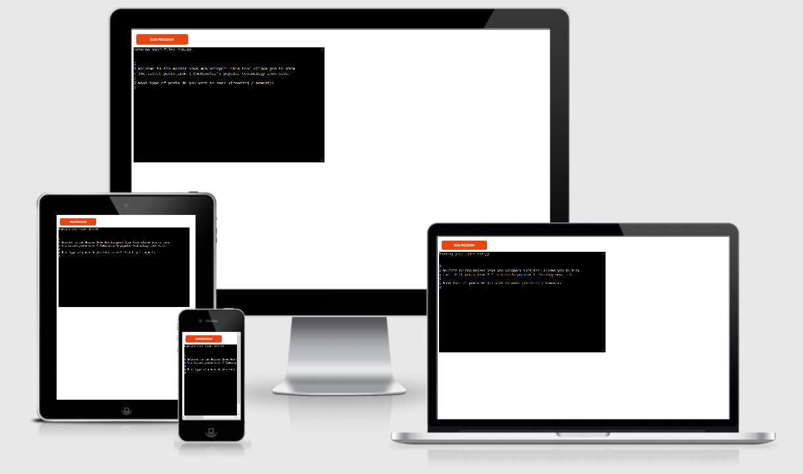

# Hacker News Scraper



The Hacker News Scraper is a Python terminal application that allows users to view posts from Y Combinator's Hacker News. Hacker News is a news site focusing on computer science and entrepreneurship. Users can see their desired amount of posts and post information from either the "trending" or "newest" pages of the website.

This application runs in Code Institute's mock terminal on Heroku.

[Project Live Link](https://hn-python-scraper.herokuapp.com/)

## User Experience (UX)

### User Stories:

-   The user wants to access Hacker News stories via the terminal.
-   The user wants to be able to see trending stories.
-   The user wants to be able to see the newest stories.
-   The user wants to choose how many stories they want to see.
-   The user wants to see information on the stories, e.g. title, link and post age.
-   The user wants to be able to keep feeding through posts after the initial ones are displayed.
-   The user's input should be validated at all stages.

[Logic Flowchart](<readme/HN Scraper Flowchart.jpeg>)

## Features

### Existing Features

-   View trending posts.
    -   Users have the ability to view a stream of posts from the front page of Hacker News.
-   View newest posts.
    -   Users have the ability to view a stream of posts from the most recent posts page.
-   Post title.
    -   Users are shown the title of each post requested.
-   Post link.
    -   Users are shown the link to the article of each post. This link can be copied in the Code Institute terminal or clicked on in some other local terminals.
-   Post age.
    -   Users are shown how long ago the post was created.
-   Request certain amount of posts.
    -   Users have the ability to instruct how many posts they want to be printed to the terminal.
-   Request more from post stream.
    -   After the initially requested posts are shown, the user will be prompted to see if they want to view more posts from the given category (trending/newest), if there are any left.
-   Post count.
    -   The user is shown how many posts are available to be shown. There are a maximum of 30 for each of the two categories, due to this being the amount shown on a full page of Hacker News. This number will go down as the user requests more posts.

### Features to Implement in the Future

-   Option to sort posts by votes.
-   Unlimited post stream.
-   Display additional post data.

## Data Model

The model for this application consists of a Posts class. This class is instantiated with the url for either the "trending" or "newest" posts pages on Hacker News.

The get_info() method within this class is responsible for retrieving the post data from the parsed HTML. This method creates a dictionary for each post. Each dictionary stores the post title, link, and date posted. These dictionaries are then all stored in a single list that can be looped through to retrieve a requested amount of post data.

## Technologies

### Languages Used

-   Python

### Frameworks and Libraries Used

-   [Git](https://git-scm.com/)
    -   Git was used for version control, using the Git Bash terminal for Windows to commit and push code.
-   [Github](https://github.com/)
    -   Github is used to store the project after pushing to Git.
-   [Heroku](https://dashboard.heroku.com/login)
    -   Heroku is used to host the application in a mock terminal.
-   [Diagrams.net](https://app.diagrams.net/)
    -   This website was used to make the logic flowchart for the project.
-   [Requests](https://docs.python-requests.org/en/master/)
    -   The Python Requests library was used to perform GET requests on the necessary links used in the app.
-   [Beautiful Soup](https://www.crummy.com/software/BeautifulSoup/bs4/doc/)
    -   Beautiful Soup is a Python module used for scraping data from websites. It was used in this project to parse the data from the GET requests and then to scrape the required information from the parsed data.

## Deployment

This project is deployed to Heroku and uses the Code Institute mock terminal.

Steps for deployment:

-   Ensure all code is pushed to Github.
-   Navigate to Heroku, login, and click "create a new app".
-   Enter a unique name for the application, and select the appropriate region.
-   Head over to "Settings" to further customise the deployment.
-   This project does not require any config vars, so this can be skipped.
-   Scroll down and add the required buildpacks. In this case, Python and Node.js are needed. They must be displayed in that order.
-   Next, head to the "Deploy" tab and select Github as the deployment method.
-   Click the "Connect to Github" button and enter your details.
-   Search for your repository and select the appropriate one.
-   You can choose to either manually deploy or enable automatic deploys. In this case, I chose automatic deploys.

Cloning the repository:

-   Navigate to the project repository.
-   In the top right, click "Fork" to fork the repo.
-   After you have your own fork of the repo, click the "Code" button. A dropdown should appear.
-   Copy the SSH key and navigate to your local terminal.
-   Clone the repo using the below command:

```
$ git clone "HTTPS URL"
```

## Credits

### Code

-   All code is unique and written by the developer.

### Content

-   All content was written by the developer.

### Acknowledgements

-   Thank you to my mentor for support through the stages of this project.
